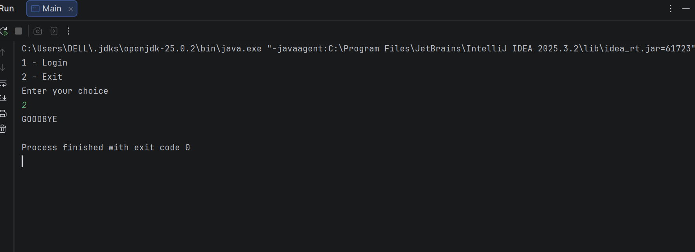
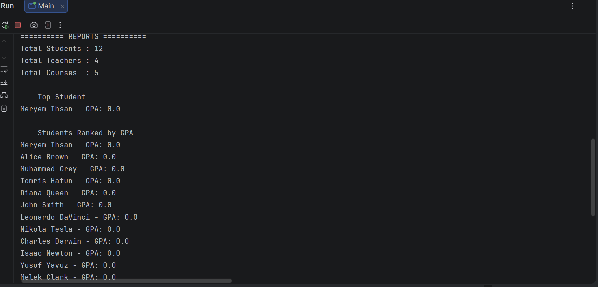

# Student Management System 🎓

A school management app — but make it terminal.
Admins run the show, teachers grade, students check if they passed. That's it.

Built with pure Java. No Spring Boot, no database, no nonsense.

---

## Who can login?

**Admin** — adds/removes students, teachers and courses. basically the principal.  
**Teacher** — views their own courses, assigns and updates grades  
**Student** — sees their profile courses, grades and GPA. fingers crossed 🤞

---

## What's inside

- Role-based login system
- Data saves when you exit, loads when you come back (File I/O)
- GPA calculator
- Top student ranking with Stream API
- Search student by number
- Input validation so you can't break it (we tried)

---

## Tech

Java 17 · OOP · Collections · Exception Handling · File I/O · Stream API

---

## Run it

Open in IntelliJ IDEA, hit run on `Main.java`. done.

---

## Admin login
Email: admin@gmail.com
Password: 12345

---

This project was built over 6 days, minimum 12 hours a day.
Every line was written carefully, every bug was hunted down personally.
No shortcuts. Just sitting at the desk until it works.

If it shows — good. That was the point.

---

Markdown
## 🛠️ The Grind Behind the Code

This project was built over **6 intense days, investing a minimum of 12 hours per day (~75+ hours total)**. 

Every single line of code was crafted purposefully, and every runtime exception was hunted down manually via strict debugging. No shortcuts were taken, no copy-paste templates were used. It was pure focus, sitting at the desk until the architecture, file synchronization, and business logic worked seamlessly together.

If the symmetry, robust input validation, and clean structure show it — good. That was exactly the point.

---

## Screenshots

### Login

### Admin Menu

### Add Student

### Teacher Menu

### Student Menu

### Reports

